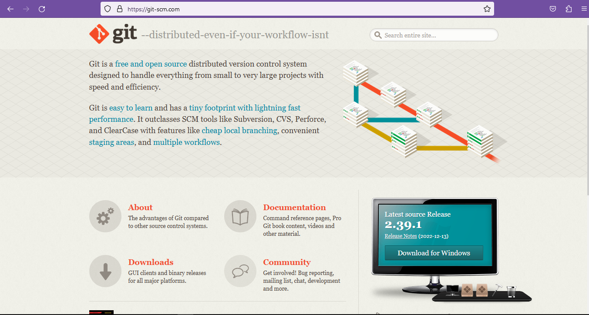
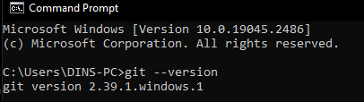
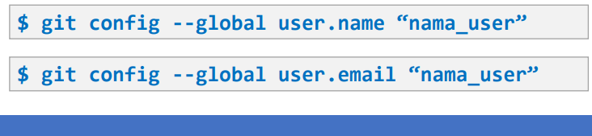
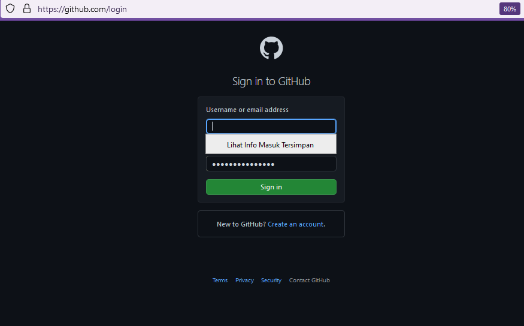
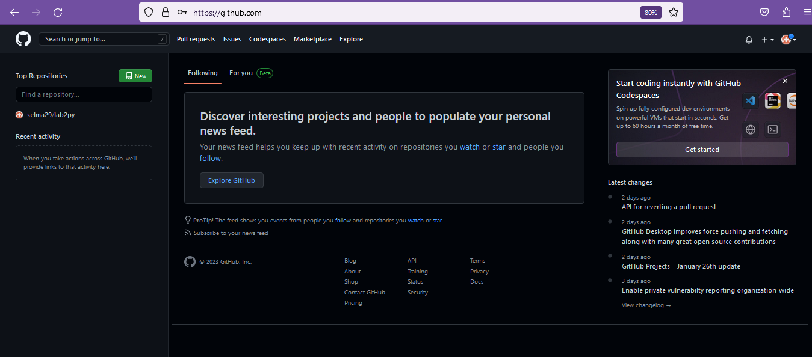

# LatihanVSC
## Tugas Pertemuan Ke 4

Nama : Selma Ohoira

NIM : 312210727

Kelas : TI.22.C9

Mata Kuliah : Bahasa Pemograman

# LANGKAH AWAL MENGGUNAKAN GIT
## CARA MENDOWNLOAD GIT
1. Langkah pertama yaitu dengan mendownload git.
   Bukalah situs resmi dari git itu sendiri yaitu git-scm.com
2. Setelah itu langsung saja mendownloadnya dengan cara memilih
   terlebih dahulu yang sesuai dengan laptop/pc yang digunakan.
   Jika itu 32bit silahkan download 32, begitu juga jika 64bit.
   Bisa langsung klik dan akan terdownload secara otomatis.

 

3. Setelah instalisasi terbuka, bisa langsung membuka command prompt
   pada menu windows dan melakukan pengecekan versi dari git kalian
   dengan mengetik syntax: git --version
4. Jika sudah mendapat tampilan seperti gambar dibawah ini artinya git telah berhasil terinstall.

5. Selanjutnya melakukan konfigurasi saat pertama kali menggunakan git.
   Hal ini agar tidak gagal saat melakukan commit. Dengan masukan perintah berikut :

Masukan email dan username

## LANGKAH AWAL MENGGUNAKAN GITHUB
# Login akun Github
1. Buka github pada situs resminya github.com
2. Setelah itu pilih menu SignUp jika memang belum mempunyai akun.
Jika sudah punya akun silahkan langsung SignIn.

Jika sudah berhasil regist, tampilannya akan seperti dibawah ini :

JIKA SEMUA PROSES DIATAS SUDAH DILAKUKAN SEMUA TANPA ADA YANG TERLEWAT,
AKUN GIT SUDAH BISA DIGUNAKAN.

SEKIAN & SELAMAT MENCOBA :)
