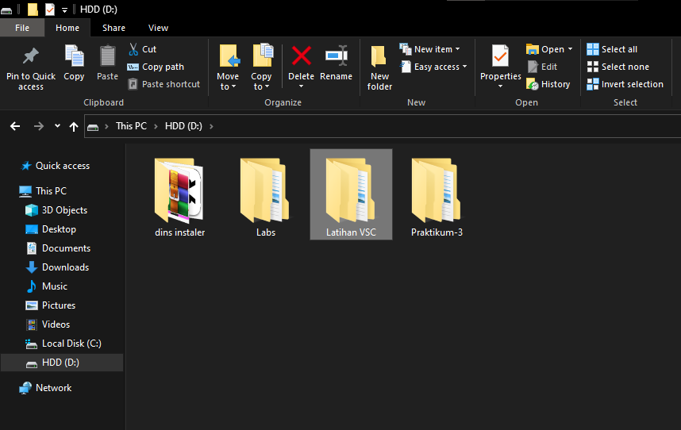
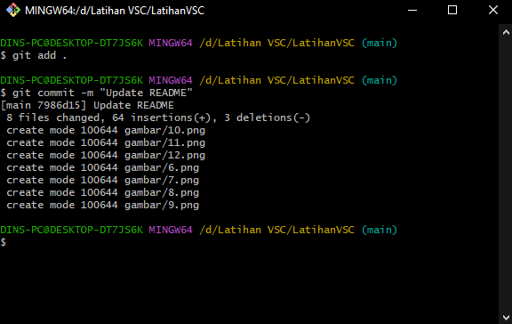

# LatihanVSC
## Tugas Pertemuan Ke 4

Nama : Selma Ohoira

NIM : 312210727

Kelas : TI.22.C9

Mata Kuliah : Bahasa Pemograman

# LANGKAH AWAL MENGGUNAKAN GIT
## CARA MENDOWNLOAD GIT
1. Langkah pertama yaitu dengan mendownload git.
   Bukalah situs resmi dari git itu sendiri yaitu git-scm.com
2. Setelah itu langsung saja mendownloadnya dengan cara memilih
   terlebih dahulu yang sesuai dengan laptop/pc yang digunakan.

   Jika itu 32bit silahkan download 32, begitu juga jika 64bit.
   Bisa langsung klik dan akan terdownload secara otomatis.

 

3. Setelah instalisasi terbuka, bisa langsung membuka command prompt
   pada menu windows dan melakukan pengecekan versi dari git kalian
   dengan mengetik code: git --version
4. Jika sudah mendapat tampilan seperti gambar dibawah ini artinya git telah berhasil terinstall.

5. Selanjutnya melakukan konfigurasi saat pertama kali menggunakan git.
   Hal ini agar tidak gagal saat melakukan commit. Dengan mengetik code:

Masukan email dan username

## LANGKAH AWAL MENGGUNAKAN GITHUB
# Login akun Github
1. Buka github pada situs resminya github.com
2. Setelah itu pilih menu SignUp jika memang belum mempunyai akun.
Jika sudah punya akun silahkan langsung SignIn.

Jika sudah berhasil regist, tampilannya akan seperti dibawah ini :

# Langkah membuat REPOSITORY pada GITHUB
1. LogIn akun github
2. Kemudian pilih dibagian start a project,
   atau bisa juga dengan menekan lambang (+) pada pojok bagian kanan atas.
3. Setelah itu pilih menu New Repository

4. Create judul yang diinginkan dan atur repository
   tersebut besifat privacy atau public.
5. Jika tampilannya seperti dibawah ini, artinya repository sudah berhasil
   dan kalian dapat membukanya pada tulisan README

   Jika ingin menulis sesuatu atau mengedit sebuah teks yang sudah ada sebelumnya
   pada lembar kerja, kalian bisa menekan gambar pensil seperti digambar diatas.
   Dan tekan commit changes untuk menyimpan perubahan pada lembar kerja.
# Setelah repository selesai, selanjutnya cara me-remmote REPOSITORY pada GITBASH lokal
1. Langkah pertama, salin URL git kita yang ada pada Github. Caranya pilih menu Code

2. Setelah link URL git tercopy, selanjutnya buka File Explorer pada windows.
   Kemudian pilih folder mana yang akan kita pakai untuk
   mendownload Repository dari Github ke lokal.

3. Kemudian klik kanan dan tekan perintah 'Git Bash Here'

4. Setelahnya pop Up Command Promp (CMD) akan terbuka. Pada proses ini kita akan melakukan
   download file repository yang tadi dibuat, dengan menggunakan code: git clone "link URL Github"

5. Setelah cloning selesai, masukan perintah code: cd (nama folder yang tadi dicloning)/
   untuk masuk kedalam folder yang telah dicloning.
6. Selanjutnya kita bisa mengedit file README.md yang ada pada File Explorer dengan menggunakan
   Text Editor (Sublime Text, Notepad, Notepad+++, Visual Studio Code).
7. Setelah mengedit, pastikan hasil editan tersimpan.
8. Langkah selanjutnya kembali membuka App GitBash dan masukan perintah
   code: git add .
9. Selanjutnya melakukan commit yang dimana fungsi commit adalah untuk menyimpan perubahan
   yang dilakukan, tetapi tidak terjadi perubahan pada remote repository.
   Caranya masukan code: git commit -m "keterangan perubahan apa yang dilakukan".

10. Setelah git commit selesai, melakukan Git Push yang dimana berfungsi untuk mengirimkan
   perubahan file yang telah dicommit ke remote repository. Caranya masukan code: git push
   

11. Jika semua langkah-langkah sudah dilakukan tanpa ada yang terlewat
Kalian bisa langsung melihat perubahan repository dengan membukanya
pada laman github.

 SEKIAN & SELAMAT MENCOBA :)